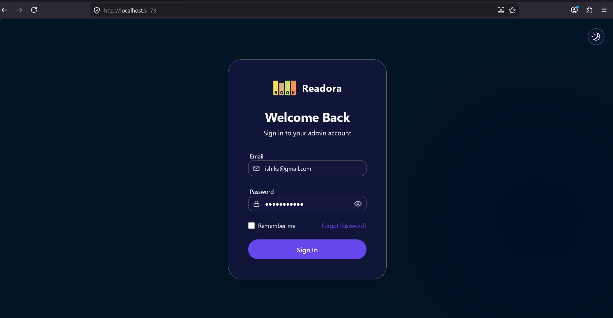
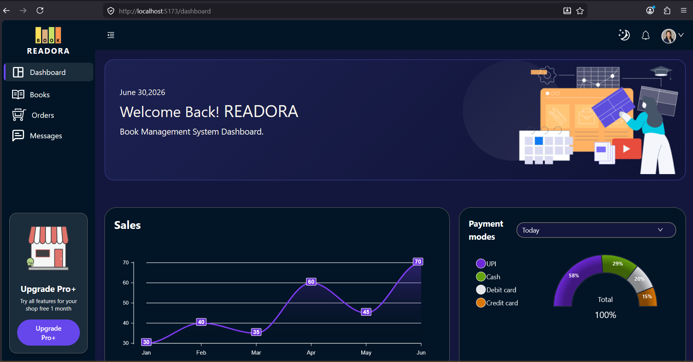

# Readora Admin Dashboard 📚

A modern, fully responsive Admin Dashboard built for managing a bookstore's operations. Developed with a focus on a premium UI/UX, it includes a comprehensive dark/light mode, glassmorphism aesthetics, and smooth animations.

## 🚀 Tech Stack

- **Framework:** [React 19](https://react.dev/) + [Vite](https://vitejs.dev/)
- **Language:** [TypeScript](https://www.typescriptlang.org/)
- **Styling:** [Tailwind CSS](https://tailwindcss.com/) + Custom CSS Variables
- **State Management:** [Zustand](https://github.com/pmndrs/zustand)
- **Routing:** [React Router v6](https://reactrouter.com/)
- **Forms & Validation:** [Formik](https://formik.org/) + [Yup](https://github.com/jquense/yup)
- **Animations:** [Framer Motion](https://www.framer.com/motion/)

## ✨ Key Features

- **Secure Authentication:** Protected routes with a beautifully animated login screen.
- **Dynamic Theming:** Seamless transition between Light and Dark modes.
- **Book Management:** Full CRUD interface for cataloging and tracking book inventory.
- **Order Processing:** Detailed tracking for all orders, returns, and transactions.
- **Messages Inbox:** A centralized hub to communicate with customers and view inquiries.
- **Profile & Settings:** Customizable user profile with notification and security preferences.
- **Premium UI:** Glassmorphism cards, responsive layouts, and modern iconography.

## 📸 Default Credentials
For demonstration purposes, you can log in using:
```
Email: ishika@gmail.com
Password: Ishika@1234
```
## Login Page


## Dashboard


## 🛠️ Getting Started

### Prerequisites
Make sure you have [Node.js](https://nodejs.org/) installed on your machine.

### Installation

1. **Clone the repository:**
   ```bash
   git clone https://github.com/your-username/Book-Store-Admin-Dashboard.git
   cd Book-Store-Admin-Dashboard
   ```

2. **Install dependencies:**
   ```npm install```

3. **Start the development server:**
   ```npm run dev```
